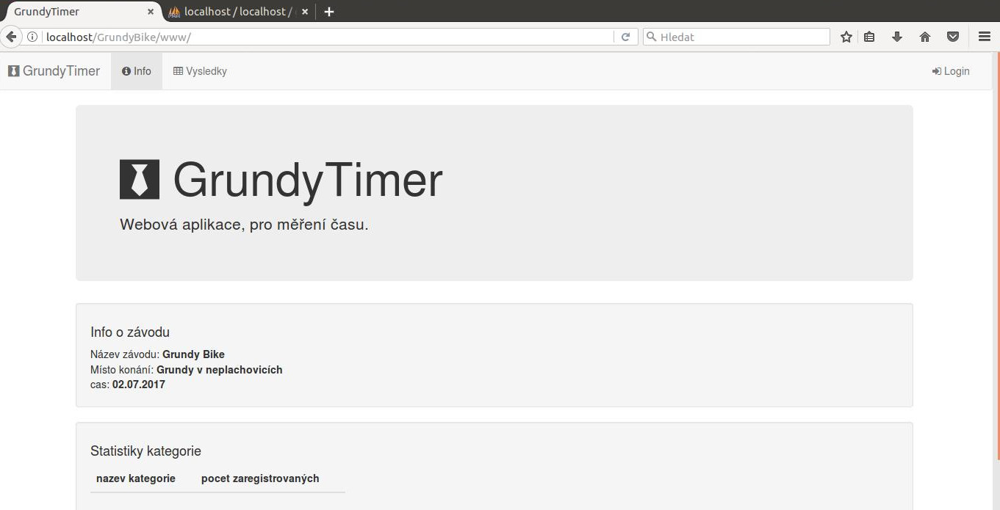
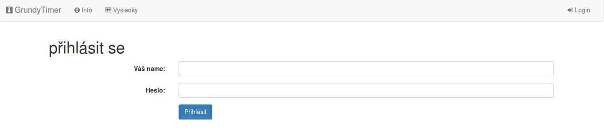
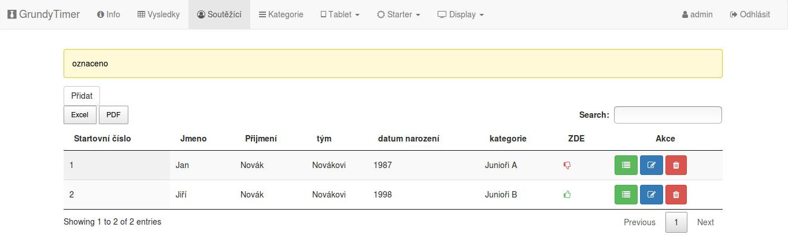
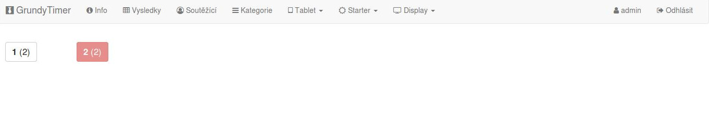
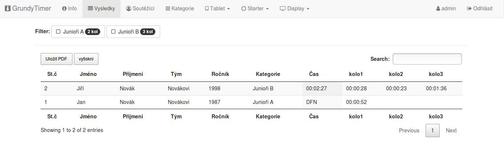
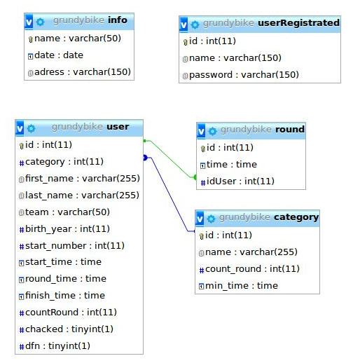

# GrundyTimer
> Webová aplikace pro měření času.

* Úvodní stánka
* přihlášení
* výpis, editace, mazání, detailní zobrazení SOUTĚŽÍCÍCH
* výpis, editace, mazání, detailní výsledky KATEGORII
* výpis výsledků (kategorie, kategorií, všech)
* controller - pro  zadávání aktuálně projíždějících osob
    * tlačítkový
    * textový
* průjezdový displej

#### Úvodní stránka

#### přihlášení do systému

#### Výpis soutěžících

#### controler

#### výsledky

### databáze

